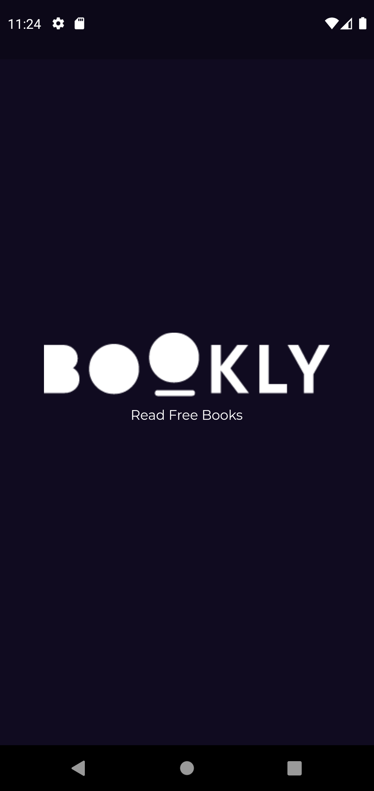
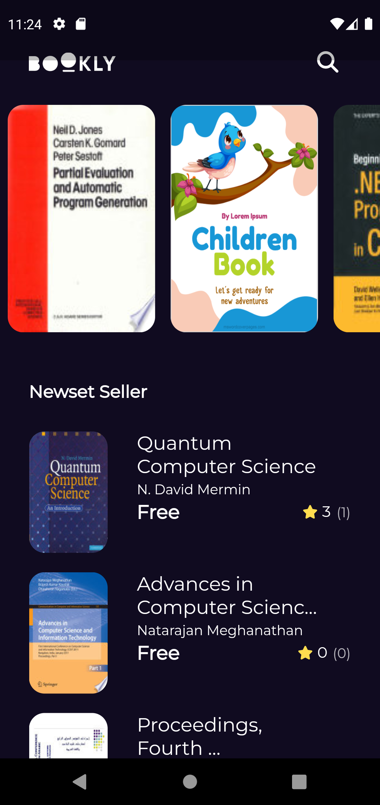
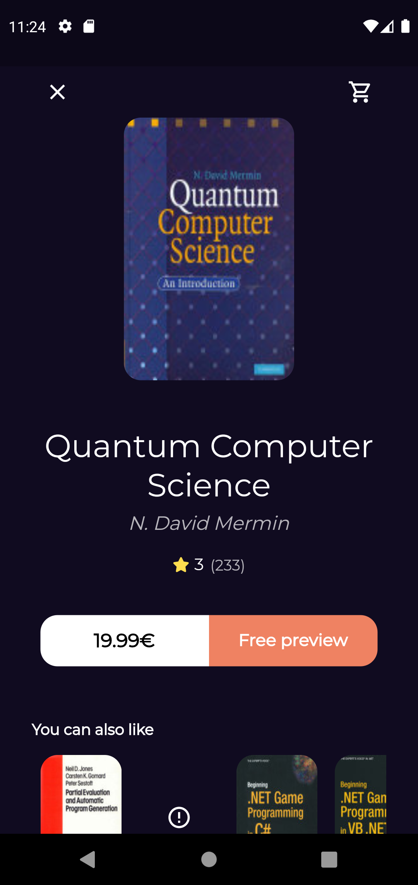
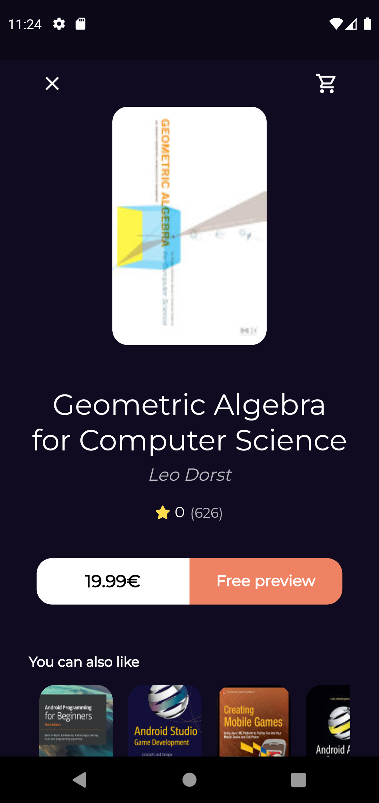

# Bookly App 📕📱

## Overview 📃

Mobile app integrated with Google Books API that can perform full-text searches and retrieve book information, viewability and eBook availability. You can also manage your personal bookshelves.

## App Features 📲

- Usage of Bloc and MVVM Pattern for clean code design.
- Display variety of books with details such as author, average rating and number of pages
- Search between books

## Screenshots 📸

| Splash Screen                      |       Home (Books View)        |
| ---------------------------------- | :----------------------------: |
|  |  |

| Book Details Screen                              |         Book Details Screen          |
| ------------------------------------------------ | :----------------------------------: |
|  |  |

Hopefully you find our app useful as well as enjoyable.
